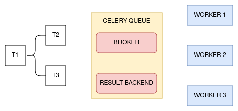

# Apache Airflow

This repository is note from watching video: [Learn to author, schedule and monitor data pipelines through practical examples using Apache Airflow](https://www.udemy.com/course/the-complete-hands-on-course-to-master-apache-airflow/learn/lecture/11945398#overview).

> Apache Airflow is an open source to programmatically author, schedule, and monitor workflows. 

> Airflow is not a data streaming solution, neither a data processing framework. 

> Airflow is an orchestrator, not a processing framework. Process your gigabytes of data outside of Airflow (i.e. you have a Spark cluster, you use an operator to execute a Spark job, and the data is processed in Spark).

### Instalation
Referece: [airflow official doccumentation](https://airflow.apache.org/docs/apache-airflow/stable/howto/docker-compose/index.html)

_First_, download docker compose.
```
curl -LfO 'https://airflow.apache.org/docs/apache-airflow/2.8.3/docker-compose.yaml'
```
_Second_, make folder for dags, logs, plugins, and config.
```
mkdir -p ./dags ./logs ./plugins ./config
echo -e "AIRFLOW_UID=$(id -u)" > .env
```
_Third_, we need to run database migrations and create the first user account. To do this, run:
```
docker compose up airflow-init
```
_Fourth_, to start all services, run:
```
docker compose up -d
```
_Fifth_, then open browser and go to 0.0.0.0:8080. Input username and password with airflow.

### Note
+ Airflow task lifecycle as follows.


+ **schedule_interval** is defines how often a DAG should be run from start_date + schedule_time. For detail, let see picture below.


+ **Executor** is defines how to run tasks. 
    + Sequential executor is not able to run multiple tasks at the same time. 
    + Local executor is able to execute multiple tasks at the same time on a single machine. Local executor does not scale very well as it depends on the machine. 
    + Celery executor is able to execute multiple tasks using different machine. \
_For example_ as picture below. If we trigger DAG, scheduler send the T1 to the broker, then WORKER1 pull out the tasks from the broker in order to execute it. And once its done, the state of the task is stored into the result backend.
 \
We need to install celery queue which may be Redis or RabbitMQ.

+ **xcom** (cross communication) is a little package that allows you to exchange small amount of data. xcom contains the information that we want to share between our tasks and it is stored into the meta database of airflow.

+ **Trigger rule** will explain one-by-one using the picture below. \

    + **all_success**: if task A and task B Success, task C is triggered. But if task A fails, then task C has the state Upstream Failed.
    + **all_failed**: if task A and task B Failed, task C is triggered. But if task A Success, then task C is Skipped.
    + **all_done**: if task A and task B done (even one of them are Failed), then task C is triggered.
    + **one_success**: if task A OR task B (one of them) is Success, then task C is triggered.
    + **one_failed**: if task A OR task B (one of them) is Failed, then task C is triggered.
    + **none_failed**: if task A and task B Success OR Skipped, then task C is triggered.
    + **none_failed_min_one_success**: if one of task is Success, then other task is Skipped, then task C is triggered.
